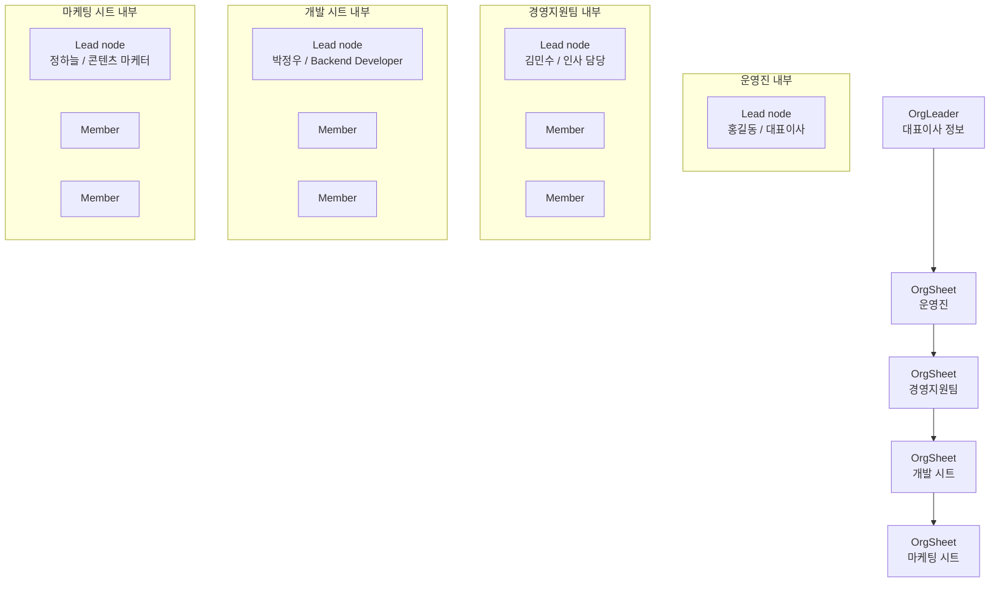

# 조직도 데이터 스키마

현재 `cody-stat` 조직도는 **시트(sheet) → 팀 리드(lead) → 멤버(member)** 구조로 렌더링합니다.

## 1) 한눈에 보는 구조

## 2) 타입 스키마

### OrgLeader
대표이사 카드용 기본 정보
- `name`
- `title`
- `subtitle`
- `avatar`

### OrgSheet
조직도를 묶는 상위 카드
- `id`
- `name`
- `description`
- `teamSlugs`

### Team
시트 안에 들어가는 팀 단위
- `slug`
- `sheetId`
- `name`
- `lead`
- `members`
- `tickets`
- `description`
- `responsibilities`
- `tone`
- `people[]`

### OrgMember
팀 안의 사람 노드
- `id`
- `name`
- `title`

## 3) 현재 렌더링 규칙

- **시트 카드**는 팀 단위를 감싸는 컨테이너
- **시트 내부 첫 노드**는 팀장/리드
- **그 아래 노드**는 멤버
- **사람 간 교차 연결은 없음**
- **엣지는 시트끼리만 연결**

## 4) 현재 데이터 관계

- `OrgLeader` → `sheet-executive` 안에 포함
- `OrgSheet` → 1개 `Team`을 가리킴
- `Team` → 여러 `OrgMember`
- `Team.lead` → 팀의 대표 표시명
- `Team.people[0]` → 보통 리드 노드

## 5) 화면 매핑

- `OrganizationFlow` = 시각화 엔진
- `orgSheets` = 상위 시트 카드 목록
- `teams` = 시트 내부 구성 데이터
- `orgLeader` = 최상단 대표이사 정보

## 6) 해석 팁

- `members` 값은 **표시 숫자**
- 실제 노드 수는 `people[]` 기준
- `sheet-executive`는 대표이사를 포함하는 예외 시트
- 나머지 시트는 팀장 + 팀원 구조
