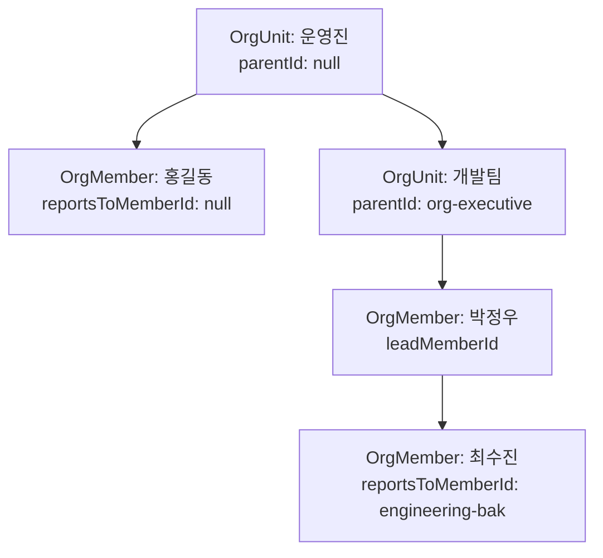

# 조직도 데이터 스키마

조직도는 `OrgUnit` 하나를 기준으로 표현합니다. 과거의 `OrgSheet`와 `Team`을 분리하지 않고, 조직 정보와 조직 내부 구성원을 한 객체에 담습니다.

## 구조

```text
OrgUnit
├── parentId                 상위 조직
├── leadMemberId             조직장
└── people[]
    ├── orgUnitId            소속 조직
    └── reportsToMemberId    보고 대상 구성원
```



## 타입

### OrgUnit
- `id`: 조직 고유 ID
- `slug`: URL용 식별자
- `name`: 조직명
- `description`: 조직 설명
- `parentId`: 상위 `OrgUnit.id`; 최상위 조직은 `null`
- `leadMemberId`: 조직장 `OrgMember.id`; 수평 조직은 `null`
- `members`: 표시용 인원 수
- `tickets`: 담당 티켓 수
- `responsibilities`: 담당 업무
- `tone`: UI 색상
- `people`: 조직 구성원 배열

### OrgMember
- `id`: 구성원 고유 ID
- `name`: 이름
- `title`: 직함
- `orgUnitId`: 소속 조직 ID
- `reportsToMemberId`: 보고 대상 구성원 ID; 최상위 구성원은 `null`

## 위계 표현 규칙

- 조직 간 위계: `OrgUnit.parentId`
- 조직장: `OrgUnit.leadMemberId`
- 사람 간 위계: `OrgMember.reportsToMemberId`
- `leadMemberId`가 `null`이면 수평 조직으로 취급
- 수평 조직에서는 구성원 간 엣지를 만들지 않음
- 조직도 루트는 `parentId === null`인 `운영진`

## 현재 목업 조직

- `org-executive`: 운영진, 최상위 조직
- `org-operations`: 경영지원팀, 운영진 하위
- `org-engineering`: 개발팀, 운영진 하위
- `org-product`: 마케팅팀, 운영진 하위

화면에서는 기존 호환성을 위해 `teams` 별칭을 유지하지만, 실제 원본 데이터는 `orgUnits`입니다.
