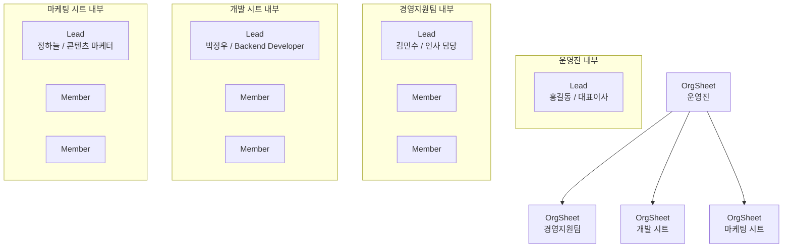

# 조직도 데이터 스키마

현재 `cody-stat` 조직도는 **운영진 시트가 최상단**이고, 그 아래에 하위 시트들이 연결되는 구조입니다.
각 시트 안에는 **팀장 → 팀원** 흐름이 기본이고, 팀장이 없으면 **수평형**으로 배치합니다.

## 1) 구조 개요

## 2) 타입 스키마

### OrgSheet
상위 조직 카드
- `id`
- `name`
- `description`
- `teamSlugs`

### Team
시트 내부 조직 단위
- `slug`
- `sheetId`
- `name`
- `lead` (`string | null`)
- `members`
- `tickets`
- `description`
- `responsibilities`
- `tone`
- `people[]`

### OrgMember
멤버 노드
- `id`
- `name`
- `title`

### OrgLeader
현재는 별도 루트 노드가 아니라, 운영진 시트 안의 리드 역할로만 사용 가능
- `name`
- `title`
- `subtitle`
- `avatar`

## 3) 렌더링 규칙

- **최상단은 운영진 시트**
- **시트끼리만 엣지 연결**
- 각 시트 내부는:
  - `lead`가 있으면 **팀장 → 팀원** 수직 구조
  - `lead`가 없으면 **팀원 수평 구조**
- 팀장/리드가 있으면 그 아래로 멤버 엣지가 연결됨
- 팀장이 없으면 멤버 간 엣지는 생략

## 4) 현재 목업 데이터

- `sheet-executive` = 운영진
- `sheet-operations` = 경영지원팀
- `sheet-engineering` = 개발 시트
- `sheet-product` = 마케팅 시트

## 5) 해석 포인트

- `members`는 표시 숫자
- 실제 노드 수는 `people[]` 기준
- `lead`가 `null`이면 수평형 조직으로 취급
- `lead`는 문자열 매칭으로 리드 노드를 찾음
